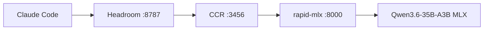
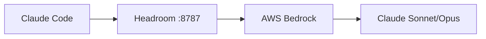

# claude-local-stack

> **Requires Apple Silicon (M1/M2/M3/M4)** — MLX inference is ARM-only. macOS only.

Local AI stack for Claude Code on Apple Silicon.
Configuration per profile:
- offline mono or multi-model routing,
- cloud
With token optimization

Since I work with many llm model and tool, it was time for me to try to manage all the mess in a more rational way.
This stack is far from state of the art, but it help me a lot for :
- my daily job
- encrypt secret (and don't wrote them everywhere ...)
- manage token compression, plugins configuration
- start playing with voice (STT/TTS) integration
- experimenting model

I know that my installation and scripts are macos only...
But with the help of an agent and local docs, i'm sure that you could translate all this stack for your personal computer.


## Architecture

### Default Profile (fully local)



### Cloud Profile (AWS Bedrock)



### Components

| Component                                               | Role                       | Port  |
| ------------------------------------------------------- | -------------------------- | ----- |
| [Headroom](https://github.com/nicobailon/headroom)      | Token compression proxy    | 8787  |
| [CCR](https://github.com/musistudio/claude-code-router) | Multi-provider task router | 3456  |
| [rapid-mlx](https://github.com/argmaxinc/rapid-mlx)     | Local MLX inference server | 8000+ |
| [AWS Bedrock](https://aws.amazon.com/bedrock/)          | Cloud LLM provider         | —     |

### Claude Plugins (token saving)

| Plugin                                                 |
| ------------------------------------------------------ |
| [RTK](https://github.com/nicobailon/rtk)               |
| [caveman](https://github.com/cyanheads/caveman)        |
| [context-mode](https://github.com/mksglu/context-mode) |

### Claude Plugins (daily use)

| Plugin                                                |
| ----------------------------------------------------- |
| [superpowers](https://claude.com/plugins/superpowers) |
| [atlassian](https://claude.com/plugins/atlassian)     |

### Stack Technologies

| Tool                                                                                | Role                     | Link        |
| ----------------------------------------------------------------------------------- | ------------------------ | ----------- |
| [asdf](https://github.com/asdf-vm/asdf)                                             | Runtime version manager  | plugins     |
| [uv](https://github.com/astral-sh/uv)                                               | Python package manager   | venvs       |
| [Homebrew](https://github.com/Homebrew/brew)                                        | macOS package manager    | formulae    |
| [overmind](https://github.com/DarthSim/overmind)                                    | Procfile process manager | tmux-backed |
| [SOPS](https://github.com/getsops/sops) + [age](https://github.com/FiloSottile/age) | Secrets encryption       | —           |

### Stack Runtimes

| Runtime                                            | Managed via | Notes                       |
| -------------------------------------------------- | ----------- | --------------------------- |
| [Python 3.12.x](https://github.com/python/cpython) | asdf        | ML compatibility            |
| [Node 22.x LTS](https://github.com/nodejs/node)    | asdf        | Claude Code / CCR           |
| [Rust](https://github.com/rust-lang/rust)          | asdf        | needed for some Python deps |


## Quick start

1. clone this repository "cd ${HOME} && git clone ..."
2. [configure your shell](./docs/integration.md#Shell)
3. Install tools: `ai-install`
4. use [ai-secret](./docs/secrets.md) to set your local secret like `ANTHROPIC_API_KEY`, `HF_TOKEN`, ...
5. Activate a profile: `ai-stack profile local`
6. Verify all deps: `ai-stack check` (install missing: `ai-stack install`)
7. boot: `ai-stack start`
8. launch Claude: `aclaude`, or VS Code: `acode`
   (`aclaude`/`acode` are shell aliases injected by `ai-stack shell` — see [docs/integration.md](docs/integration.md))


## Profiles

Switch routing strategy, models, and services per workflow:

- `local`: [local only](./config/profiles/local/readme.md) — no cloud account needed
- `cloud`: [aws bedrock](./config/profiles/cloud/readme.md) — requires AWS CLI configured with Bedrock access (`aws configure`, model access enabled in us-east-1 or eu-west-1)


```bash
ai-stack profile local   # switch profile
ai-stack profile          # show current
```

See [docs/profiles.md](docs/profiles.md) for routing matrix and details.

## CLI reference

See [docs/cli.md](docs/cli.md) for full reference.

### Stack management

```bash
ai-stack start              # start all services
ai-stack stop               # stop all
ai-stack restart [svc]      # restart all or one
ai-stack status             # running processes
ai-stack logs [svc]         # stream or attach logs
ai-stack enable <svc...>    # uncomment service, restart if running
ai-stack disable <svc...>   # comment service, restart if running
ai-stack shell              # subshell with env + secrets loaded
ai-stack check [profile]    # dep report for active (or named) profile
ai-stack install [profile]  # install all missing deps
```

### Installation

```bash
ai-install                  # full install
ai-install headroom rtk     # cherry-pick by name
ai-install --list           # available components
```

### Secrets

```bash
ai-secrets init             # generate age key + SOPS config
ai-secrets edit             # decrypt → edit → re-encrypt
ai-secrets get <key>        # print one value
ai-secrets show             # show all
ai-secrets rotate           # rotate keys
```

### Models

Even if this client sit on top of hf (hugging face), I still like to see somewhere a list of my [model](./config/models.yaml) than I use ...
This cli use hugging face local cache to store them, as most of our tool use it, it fix my fears....

```bash
ai-models pull              # download all
ai-models pull llm          # download a category
ai-models list              # show manifest + status
```

See [docs/cli.md](docs/cli.md) for full reference.

## Integration

Point any tool at `http://localhost:8787` with `ANTHROPIC_API_KEY=local`.

> `ANTHROPIC_API_KEY=local` is a sentinel value — Headroom intercepts requests at port 8787 and routes them to the active profile backend. No real Anthropic key is sent when using local/Bedrock profiles.

| Tool                 | Config                                                                   |
| -------------------- | ------------------------------------------------------------------------ |
| Claude Code CLI      | `ai-stack shell` then `claude`                                           |
| VS Code + Continue   | `.continue/config.yaml` — see [docs/integration.md](docs/integration.md) |
| VS Code + Claude ext | `settings.json` — see [docs/integration.md](docs/integration.md)         |

## Repository layout

```
ai-stack/
├── bin/              # CLI tools (ai-stack, ai-install, ai-secrets, ai-models)
├── config/
│   ├── ai-stack.env        # project paths
│   ├── base-services.yaml  # universal deps (claude-code, superpowers, overmind)
│   ├── profiles/           # profile definitions (local, mistral, mistral-light, multi, cloud)
│   ├── Procfile            # active service definitions
│   └── models.yaml         # model manifest
├── lib/
│   ├── setup/        # one-shot bootstrap scripts (prerequisites, runtimes, tooling)
│   ├── services/     # daemons and installable tools (rapid-mlx, headroom, ccr, claude-code…)
│   ├── plugins/      # Claude Code plugins (rtk, context-mode, superpowers, caveman, agent-skills…)
│   └── utils/        # helpers
├── secrets/          # SOPS-encrypted keys
├── logs/             # runtime logs (gitignored)
└── docs/
```

## What's gitignored

- `secrets/age-key.txt` — private key
- `secrets/api-keys.sops.yaml` — encrypted secrets
- `config/.active-profile` — runtime state
- `logs/` — runtime output
- `lib/services/*/.venv/` — recreated via install

## Docs

| Topic       | File                                       |
| ----------- | ------------------------------------------ |
| CLI         | [docs/cli.md](docs/cli.md)                 |
| Profiles    | [docs/profiles.md](docs/profiles.md)       |
| Components  | [docs/components.md](docs/components.md)   |
| Integration | [docs/integration.md](docs/integration.md) |
| Models      | [docs/models.md](docs/models.md)           |
| Secrets     | [docs/secrets.md](docs/secrets.md)         |
| Overmind    | [docs/overmind.md](docs/overmind.md)       |
