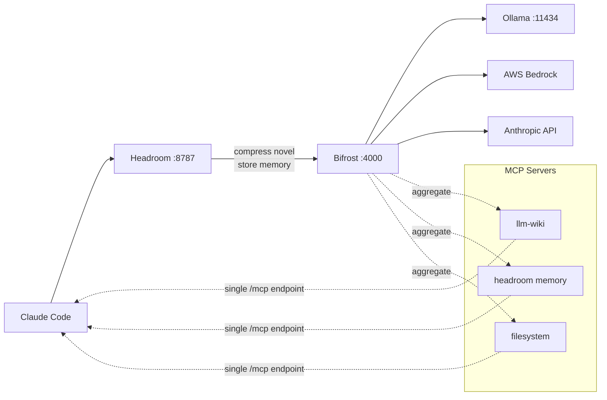

# Roadmap: Bifrost — Router + MCP Gateway + Skills Marketplace

## What Bifrost Is

[Bifrost](https://git.new/bifrost) is a Go gateway (~11µs overhead) that combines three roles in one process:

1. **LLM Router** — multi-provider routing via CEL model aliases (replaces LiteLLM/CCR)
2. **MCP Aggregator** — connects to all your MCP servers, exposes them as one `/mcp` endpoint
3. **Skills Marketplace** — hosts versioned agent skills, registers as a Claude Code marketplace

Installed via `npx -y @maximhq/bifrost` (Go binary distributed as npm package, no Homebrew/brew available).

## vs LiteLLM (routing only)

| Feature | LiteLLM | Bifrost |
|---------|---------|---------|
| Routing by model name | Yes — `model_name` in YAML | Yes — CEL expression aliases |
| Ollama support | Native (`ollama/model`) | Native (explicit `base_url` required) |
| AWS Bedrock support | Native | Native |
| Anthropic support | Native | Native |
| Fallbacks | Yes | Yes (exponential backoff) |
| Semantic caching | No (OSS) | Yes — exact hash + vector similarity |
| Prometheus / OTel | Limited (OSS) | Native |
| Web UI | No (OSS) | Yes |
| Runtime | Python — slow cold start | Go — ~11µs overhead |
| Config syntax | Simple YAML `model_list` | CEL expressions (more powerful, more verbose) |
| Install | `uvx --from litellm[proxy] litellm` | `npx -y @maximhq/bifrost` |
| MCP gateway | No | Yes — aggregates all MCP servers |
| Skills marketplace | No | Yes |
| LiteLLM migration | — | Official guide `/migration-guides/litellm.md` |

**Verdict:** Bifrost is now the router for profiles that use OpenAI-compatible local backends (rapid-mlx-test). LiteLLM remains for profiles where Anthropic→OpenAI conversion is not needed. Migration trigger: any profile routing through rapid-mlx or a custom OpenAI-compatible server should use bifrost — litellm's `/v1/messages` path strips tools before forwarding.

## MCP Gateway

Bifrost acts as both MCP client and MCP server simultaneously:

```
MCP servers (llm-wiki :port, headroom :8787, filesystem, web-search…)
    ↓  Bifrost connects to each (MCP client)
Bifrost /mcp  ← single aggregated endpoint
    ↓  Claude Code connects once (MCP server)
```

**Tool Filtering** — per virtual-key or per-request allowlists. Restrict which tools a given agent session can call.

**Agent Mode** — autonomous tool execution with configurable per-tool auto-approval.

**Code Mode** — AI writes and executes Python to orchestrate multiple tools. Multi-step agentic flows without a custom harness.

## Skills Marketplace

Bifrost hosts versioned agent skills. Register Bifrost as a marketplace source in Claude Code:

```bash
claude plugin install http://localhost:4000/skills
```

Skills are created, versioned (SemVer), and published from the Bifrost web UI. Any Claude Code session pointed at the local Bifrost instance gets the same skill catalog.

## Bifrost CLI (separate package)

`npx -y @maximhq/bifrost-cli` — launches Claude Code (or Codex) through Bifrost:

- Auto-registers Bifrost's `/mcp` endpoint into the session
- Model selection UI
- Worktree support for parallel work: `-worktree feature-branch`
- No manual env var setup needed

## Proposal: Unified Claude Code Management

### Problem

Current state:
- MCP servers (`headroom`, `llm-wiki`, …) registered individually in `~/.claude.json` by each service's install script
- Adding a new MCP server = update every Claude Code install
- Terminal (`aclaude`) and VSCode (`acode`) are aliases that source env vars — no awareness of available tools
- Skills managed per-machine via `claude plugin install <url>` — no central catalog

### Target Architecture (with Bifrost)

```
Claude Code (terminal / VSCode extension)
    │  ANTHROPIC_BASE_URL=http://localhost:8787   ← unchanged
    │  MCP endpoint=http://localhost:4000/mcp     ← single registration
    ↓
Headroom (:8787) → token compression
    ↓
Bifrost (:4000) → routing + MCP aggregation + skills
    ├── LLM: Ollama / Bedrock / Anthropic
    └── MCP: llm-wiki, headroom-memory, filesystem, …
```

### Terminal: replace `aclaude` with Bifrost CLI

Today `aclaude` = shell alias that sets env vars then calls `claude`. Replace with:

```bash
# lib/services/bifrost/launch-claude
npx -y @maximhq/bifrost-cli \
  --provider http://localhost:8787 \
  --mcp-endpoint http://localhost:4000/mcp
```

Or keep `aclaude` but have `ai-stack shell` also register the Bifrost MCP endpoint into the session's `CLAUDE_MCP_SERVERS` env var.

### VSCode: single settings entry

VSCode extension reads `ANTHROPIC_BASE_URL` from env. When launched via `acode` (which sources the stack env), LLM routing already works. Add MCP:

```json
// .vscode/settings.json (or User settings)
{
  "claude.apiBaseUrl": "http://localhost:8787",
  "claude.mcpServers": {
    "bifrost": {
      "url": "http://localhost:4000/mcp"
    }
  }
}
```

One entry covers all tools — no per-server wiring in VSCode settings.

### MCP management via ai-stack

Add `ai-stack mcp` commands backed by Bifrost REST API:

```bash
ai-stack mcp list             # list registered MCP servers in Bifrost
ai-stack mcp add <name> <url> # register an MCP server
ai-stack mcp remove <name>    # deregister
```

Profile activation would call `ai-stack mcp add` for each server in the `mcp:` section of `services.yaml` — replacing the current per-service `headroom mcp install` calls.

### Skills management via ai-stack

```bash
ai-stack skill list            # list skills in local Bifrost marketplace
ai-stack skill install <name>  # install into current Claude Code session
ai-stack skill publish <path>  # publish a local skill to Bifrost
```

## Migration Status

Bifrost replaced LiteLLM across all profiles. Root cause: LiteLLM's `/v1/messages` (Anthropic format) path strips `tools` before forwarding to OpenAI-compatible backends — tool schemas never reach the model.

All profiles now use bifrost at port 4000:

| Profile | Provider type | Config |
|---------|--------------|--------|
| local | OpenAI-compatible (rapid-mlx) | `bifrost/config.json` |
| mistral | OpenAI-compatible (Ollama) | `bifrost/config.json` |
| mistral-light | OpenAI-compatible (Ollama) | `bifrost/config.json` |
| rapid-mlx-test | OpenAI-compatible (rapid-mlx) | `bifrost/config.json` |
| max | Anthropic native | `bifrost/config.json.tpl` (envsubst `$ANTHROPIC_API_KEY`) |
| aws-bedrock | Bedrock native | `bifrost/config.json.tpl` (envsubst `$AWS_ACCESS_KEY_ID`, `$AWS_REGION`) |

Profiles `max-direct` and `bedrock-direct` bypass bifrost — headroom talks directly to Anthropic/Bedrock.

LiteLLM service files are kept at `lib/services/litellm/` but no profile references them.

Next migration levers (when needed):
- MCP server count grows beyond 3 — wire bifrost's `/mcp` aggregator instead of per-server `~/.claude.json` entries
- Observability needed — bifrost's Prometheus metrics + web UI
- Semantic caching — reduce Bedrock/Anthropic spend

## Full Stack Architecture (with Bifrost)

```
Claude Code → Headroom (:8787) → Bifrost (:4000) → providers
                ↑                    ↑
          compress novel         cache repeated
          store memory           route + observe
```



## Bifrost Ollama Gotcha

`base_url` must be explicitly configured for Ollama — no default. Requests fail silently without it. Set via web UI or API before first use.
